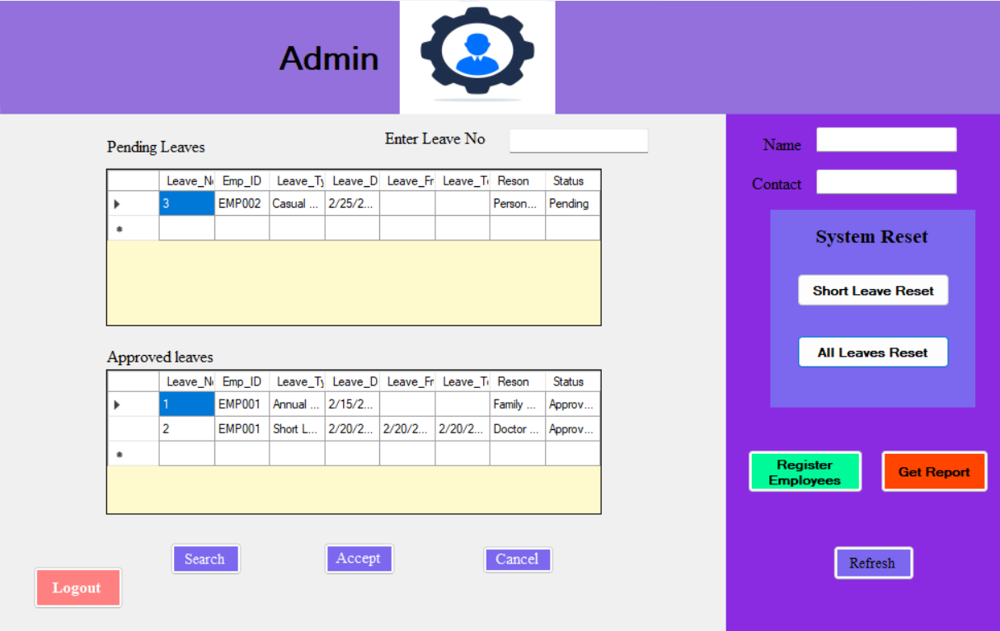
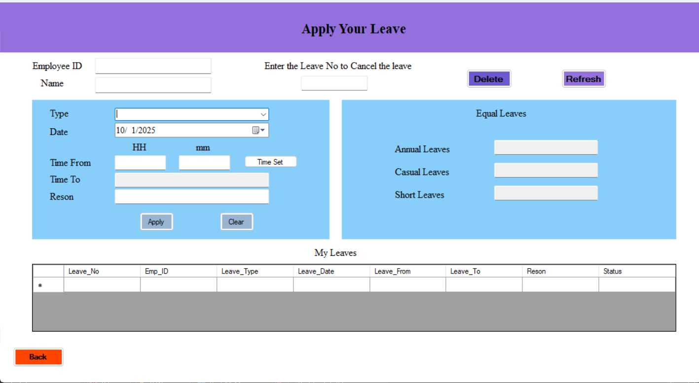
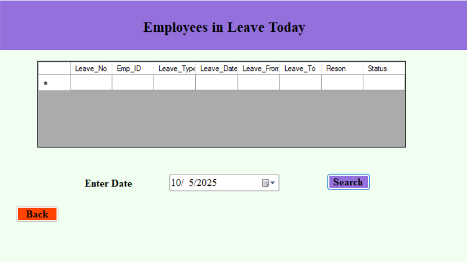

# Grifindo-Lanka-Leave-Management-System
This project is a Windows-based Leave Management System developed for  Grifindo Lanka Toys (PVT) LTD.
# 🏢 Grifindo Lanka Toys (PVT) LTD  
## Employee Leave Management System

---

## 📌 Project Overview

This project is a Windows-based Leave Management System developed for  
**Grifindo Lanka Toys (PVT) LTD**.

The system was built to manage employee registrations, leave applications, approvals, and reporting processes efficiently.

The system follows structured programming principles and database integration for secure data handling.

---

## 💻 Technologies Used

- C# (.NET Windows Forms)
- SQL Database
- Object-Oriented Programming (OOP)
- CRUD Operations
- DataGridView Controls
- Event-Driven Programming

---

## 🔐 System Modules

### 🔑 1. Login System
- Secure authentication using User ID and Password
- Role-based access (Admin / Employee)

---

### 👨‍💼 2. Admin Dashboard
- View Pending Leave Requests
- Approve / Reject Leave
- Search Leave Records
- Reset System
- Generate Reports

---

### 👤 3. Employee Registration Module
- Add New Employees
- Update Employee Information
- Delete Employees
- Search by Employee ID
- Auto calculate worked months

---

### 📝 4. Leave Application Module
- Apply Annual, Casual, and Short Leaves
- Select Leave Date and Time
- Cancel Leave
- View Personal Leave History
- Automatic Leave Balance Tracking

---

### 📊 5. Leave Reports
- View Employees on Leave for Selected Date
- Generate Leave Status Reports

---

## 🗂 System Features

- Department-based leave control
- Leave balance tracking
- Admin approval workflow
- Real-time data display
- Secure password management
- Database-driven architecture

---

## 🖥 Application Screenshots

### Welcome Screen

### Login Screen

### Admin Dashboard

### Employee Registration

### Apply Leave

### Leave Report

---

## 🚀 How to Run

1. Open project in Visual Studio
2. Configure database connection string
3. Run the project
4. Login using Admin credentials

---

## 📈 Learning Outcomes

- Implemented CRUD operations
- Designed relational database structure
- Applied OOP principles
- Built authentication system
- Developed complete workflow system

---

## 👨‍💻 Author

**Pasindu Nilupul**  
BEng (Hons) Computer Networking & Cloud Security (Top-Up)  
London Metropolitan University (UK)

Aspiring Network & Security Engineer
